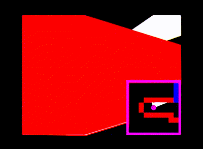
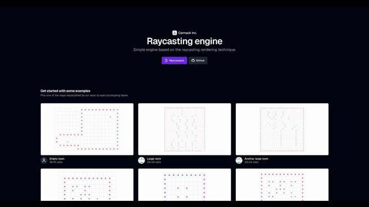
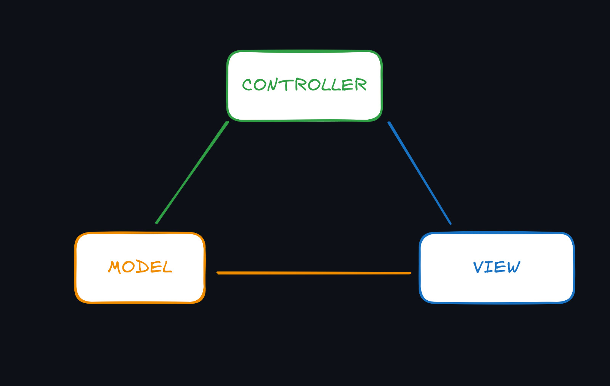

# **Raycasting Engine**

A **raycasting-based 3D game engine** built in **TypeScript**, featuring a **WebUI with React and Shadcn**, and a **custom-built backend engine**.  
This group project was developed as part of a university course on **Software Engineering Practices** at Universidade Federal do ABC (UFABC), focusing on **agile development practices, UML diagrams, and unit testing**.

Inspired by [Lode Vandevenne`s](https://lodev.org/cgtutor/raycasting.html) raycasting tutorial

## **Demo**

Try it live:  
<a href="https://carmack-inc.github.io/raycasting-engine/" target="_blank">raycasting engine</a>

> Showcase of the gameplay using the engine, rendering of textures is turned off for this  


> Showcase of the web UI, rendering of textures is turned on for this  


## **Table of Contents**
- [Features](#features)
- [Architecture](#architecture)
- [Getting Started](#getting-started)
- [My Contribuition](#my-contribuition)
- [Usage](#usage)
- [License](#license)

## **Features**
- **Custom raycasting engine** implemented in **TypeScript**
- **Web-based UI** using **React** and **Shadcn components**
- **Player movement**, **collision detection**, and **enemies**
- Support for **custom levels** that can be made in the browser
- Focused on **software engineering practices**: modularity, type safety, unit tests

## **Architecture**



The team adopted the **Model-View-Controller (MVC) architectural pattern** to separate **game logic**, **user interaction**, and **rendering**.

### **Model**
The **Model** is responsible for the **core game state** and **engine logic**.  
It includes:
- **Map data**
- **Player state** (position, direction, movement)
- **Raycasting calculations** and **collision detection**

### **View**
The **View** handles the **presentation of the content**.  
It is implemented using a **Canvas element** and is responsible for:
- **Rendering the scene and HUD**
- **Displaying engine state** to the user
- **Updating visuals** when the model changes

### **Controller**
The **Controller** acts as the **intermediary between the View and the Model**.  
Its responsibilities include:
- Handling **keyboard and mouse input**
- Translating **user actions into game commands**
- Updating the **Model** accordingly

## Getting Started


### Dependencies
- **Node.js**
- **pnpm**

```bash
git clone https://github.com/GardenMovie/raycasting-engine.git
cd raycasting-engine

# Install dependencies
pnpm install

# Start development Server
pnpm run dev
```

Open [http://localhost:3000](http://localhost:3000) your browser to see the engine in action.

## **Usage**

- Move the player: ```W```, ```A```, ```S```, ```D```
- Rotate view: Mouse

## **My Contribution**
- **Designed and documented** the engine architecture, including high-level diagrams, module interactions, and use cases
- Implemented **frontend UI components**
- Assisted with **core feature implementations** and helped team members write components

## **License**
This project is for **educational and viewing purposes only**.  
No part of this code may be copied, modified, distributed, or used in any way without **explicit permission** from the authors.
